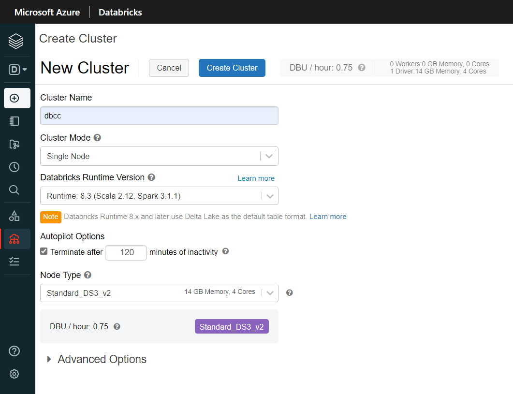
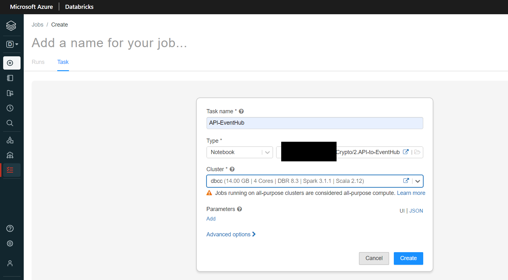
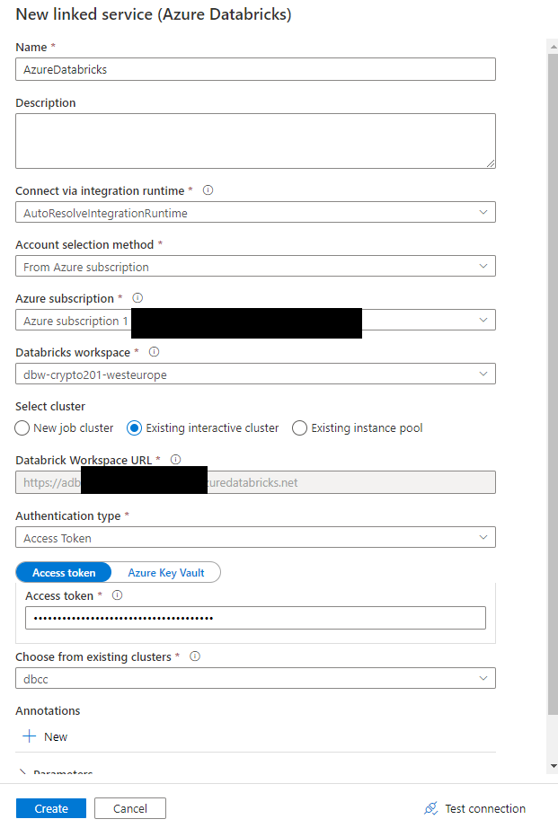
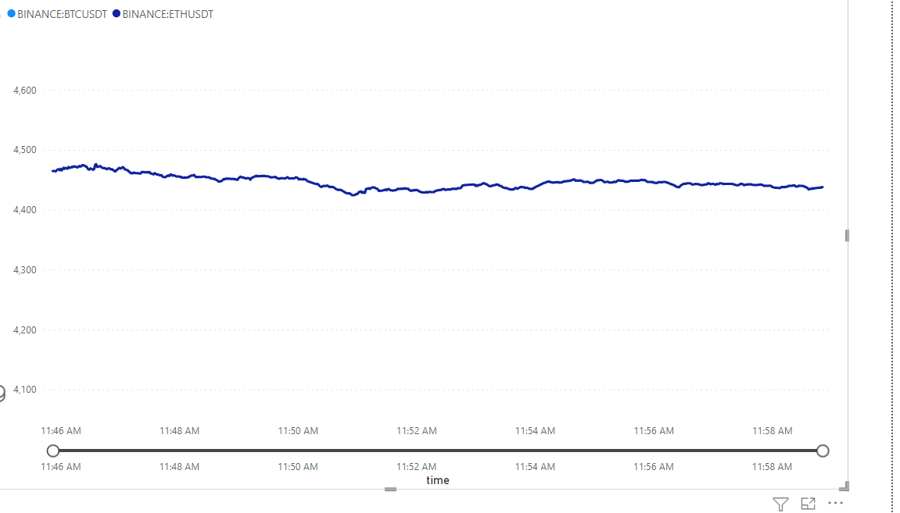

# Crypto currency project

This project takes crypto currency (Bitcoin, Ethereum) data 
from REST API (finnhub.io), loads them into **Azure EventHub**. From there,
this data gets captured and stored into **Azure Data Lake Storage** Raw Area, then it gets cleaned
and written by Spark Structured Stream to Staged Area. From this area it goes
to **MongoDB Atlas** (By **Azure Data Factory** Copy Activity) and gets processed by 
Spark Structured Stream (aggregations, business values) and written to Prepared
Area while simultaneously being displayed at **PowerBI Dashboard**


### Requierments:
* Active Azure Subscription (Standard or Premium)
* MongoDB Atlas (follow this guide to register)  
https://cloudnodelab.azurewebsites.net/provisioning-a-mongodb-atlas-cluster-to-azure/  
* Terraform  
https://learn.hashicorp.com/tutorials/terraform/install-cli
* PowerBI Desktop  
https://powerbi.microsoft.com/en-us/desktop/

### Tools used:
* Cloud service - **Microsoft Azure**
* Infrastructure deployment - **Terraform**
* Scheduling & orchestration - **Data Factory**
* Messaging system - **Event Hub**
* Data processing - **Apache Spark (Databricks)**
* Storage:
    * Data lake - **Data Lake Storage Gen 2**
    * Database - **MongoDB Atlas**
* Reporting - **Power BI Desktop**

### 1. Create Azure resources using terraform  
``` 
az login
terraform init
```


```
terraform plan -out=crypto-plan
```


```
terraform apply "crypto-plan"
```


Wait about 5 minutes for plan to apply


### 2. Configure security (tokens, secrets)
* ADLS Token  

Go to Storage Account on Azure, select **"Shared acces signature"**
under **"Security + networking"** tab


Check allowed resources type and increase expiration date


Generate SAS. Save **SAS token** field, you will need it later


* EventHub Connection String

Go to **EventHub** namespace, **“Shared access policies”** under **“Settings”** tab. Choose **RootManageSharedAccessKey**  

Save **“Connection string–primary key”** 


Now go to **KeyVault** and create two secrets for **ADLS** and **EventHub** with values from previous steps


* Databricks secret scope  
Now to link Datbricks with Azure KeyVault we need to create secret scope
(there is no button on UI, so you have to do it using **Databricks CLI** or by adding 
**#secrets/createScope** to workspace URL. In this example I will go with the latter

First, open KeyVault in another tab, then go to **"Properties"** under **"Settings"** tab
We will need two fields: **"Vault URI"** and **"Resource ID"**


Go to Databricks create scope window


Change **“Manage principal”** to **"All users"** if you use Trial or Standard subscription.  
In **“DNS Name”** paste **“Vault URI”** from Key Vault Properties.  
In **“Resource ID”** paste **“Resource ID”**. 


Save the name of this scope (!)

### 3. Databricks

* Create cluster



* Import **"Crypto.dbc"** to workspace


* Create Databricks job with notebook **"2.Api-to-EventHub"** and start it



* We need a token to connect **Data Factory** to **Databricks**

Go to **“Settings”** - **“User settings”** - **“Generate new token”**  
Copy generated value(!) 


### 4. Data Factory

* Open **"Azure Data Factory Studio"**


Create new pipeline and add 4 Databricks notebooks 
to it. Now we need to connect our Databricks workspace to ADF using token from 
previous step 

Click on first notebook created in ADF, go to **“Azure Databricks”** panel 
and click on “New” 

Choose your subscription, Databricks workspace, check 
**“Existing interactive cluster”**, set **“Authentication type”** to **“Access Token”**
and paste Databricks token to the next field. Choose the existing cluster in
the next field. Then click “Create” 




Now connect this Databricks workspace to the other notebooks. 
Import notebooks number **1, 3, 4, 5** from your Databricks workspace
and connect them with green (**on success**) arrows in the same
order. Name them accordingly 


Create trigger to run this pipeline every minute. Click **“Trigger”** - **“New/Edit”**. Create new trigger and schedule to it once a minute


Now we need to create **“Copy Activity”** from **ADLS** Staged Area to **MongoDB Atlas**. Go to Data Factory home page and choose **“Ingest”** 


Choose **“Built-in-copy-task”**. Check **“Tumbling window”** type, set **“Recurrence”** to **5 minutes** and click “Next” 


Choose **“ADLS Gen 2”** as Source type and create new Connection with Account key Authentication 


Set a path to data in staged area. Choose **“Incremental load: LastModifiedDate”** as **"File loading behaviour"**.  


Choose **parquet** format, **snappy** compression 


Choose **MongoDB Atlas** as Destination data store, use your Mongo connection string and database name for connection. Check “Skip schema mapping” at the bottom of the page


### 5. PowerBI  

* Open PowerBI Desktop
* Go to:
  * "Home" - "Get data" - "More" - search "Spark"


* Open Databricks in other window and go to "Compute" -> "Configuration" -> "JDBC/ODBC"
* Open any text editor and paste part of string from "JDBC URL" field from beginning to "443/" including
* Replace "jdbc:spark" to "https"
* Now add string from "Http Path" field to the end of URL
* Copy the result, it should look like this:
  * **https://\<workspace>.azuredatabricks.net:443/sql/protocolv1/o/\<n>/\<n>**
  


* Paste this URL to "Server" field in PowerBI. Set "Protocol" to HTTP


* Choose table from Databricks and press "Load"


* In this example I chose the "Line chart" model with crypto price timeline
  * "Axis" - **time**
  * "Legend" - **abbreviation**
  * "Values" - **last_price**


* Enable zoom slider to zoom on chart  


##Result:
  * ### Bitcoin chart


  * ### Ethereum chart



  * ### Silver data


  * ### Gold data


  * ### MongoDB Atlas (Silver data)


